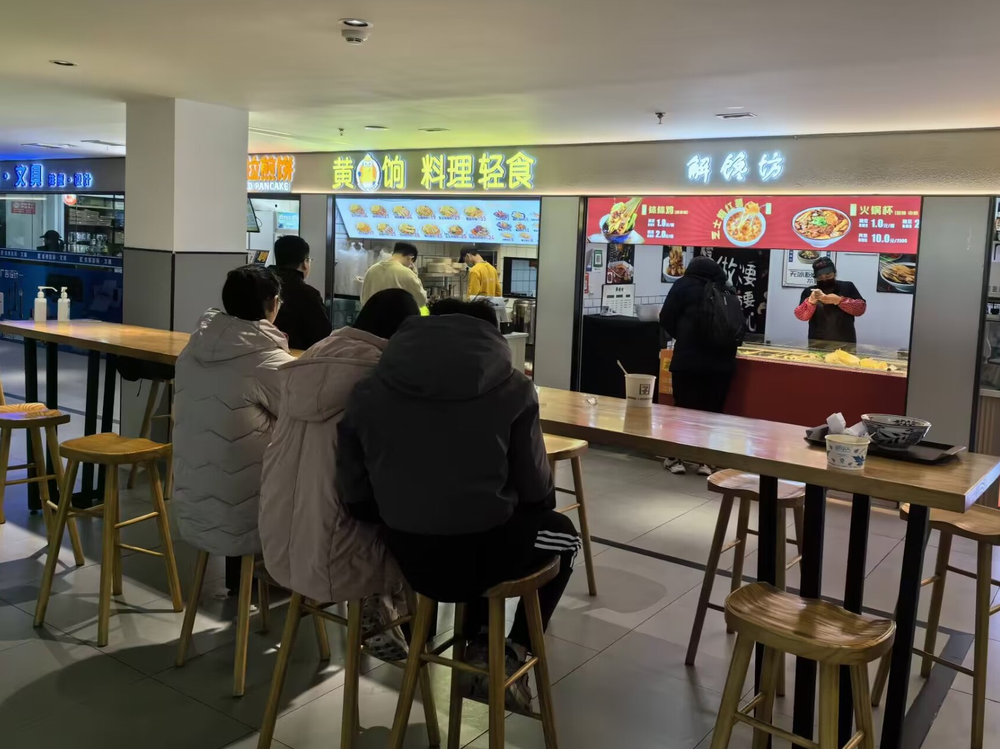
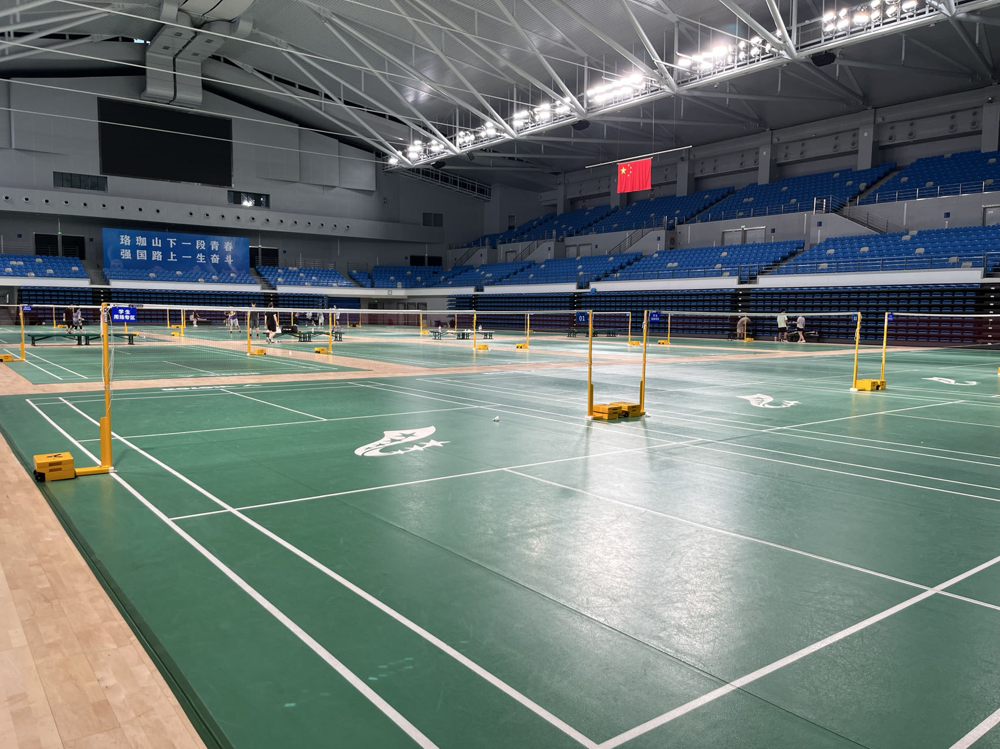
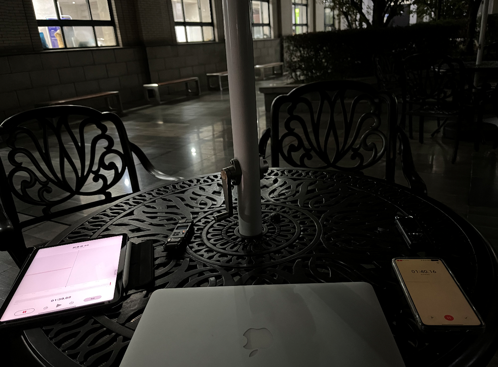
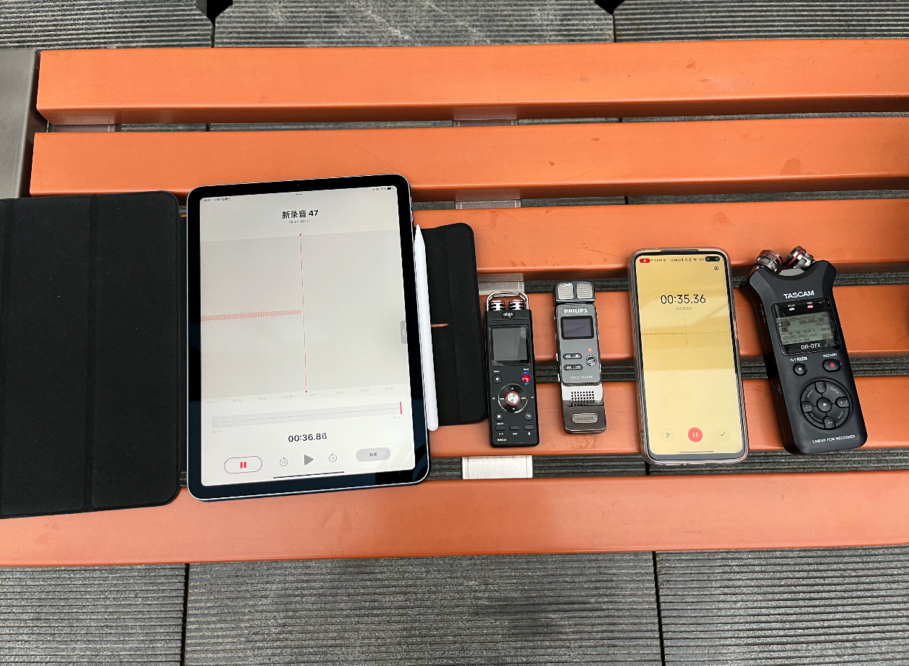

# Overview
This repository is dedicated to the **ENF-NAH-Dataset**, an Electric Network Frequency (ENF) audio dataset collected around **Wuhan University** under unconstrained scenarios. It presents significant challenges to signal processing algorithms by complex and unconstrained real-world environments, where the weakness and partial absence of ENF signals along with environmental noise interference are prevalent. Additionally, it offers the platform to assess the impact of various recording devices on the ability to capture ENF signals, thereby increasing the complexity of analysis and application in broader and more practical scenarios.

- **Recording location**: coffee shops, KTVs, cinemas, parking lots, squares, parks, *etc.*, totaling more than ten different scenes.
- **Environment diversity**: day/night, rainy/sunny, interior/exterior.
- **Recording device**: Redmi K40, Aigo R6633, iPad Air4, Tascam DR-07x, Philips VTR7100, iPhone 13, *etc.*, totaling ten different devices.
- **Duration**: 2~30 minutes
- **Format**: PCM WAVE
- **Quantization depth**: 16-bit
- **Channel**: mono
- **Sampling frequency**: 8000 Hz (400 Hz for reference data)
- **Category**:
  - **'H'**: "001~265.wav" 265 real-world recordings with captured ENF (noisy).
  - **'H_ref'**: "ref_001~ref_265.wav" the corresponding 265 reference ENF (noise-free, same duration) obtained from power main.
  - **'H_ref_one_day'**: the corresponding one-day (24 hours) reference ENF for the 265 recordings. "1-2,41-42,51,57.wav" means "001.wav", "002.wav", "041.wav", "042.wav", "051.wav" and "057.wav" in 'H1' folder are recorded within the same day.
# Note about the Ground-Truth 
The ground-truth matched location (the lag that corresponds to the true timestamp) can be determined by aligning noise-free reference files with their respective one-day references. For instance, matching "ref_041.wav" in 'H_ref' folder with "1-2,41-42,51,57.wav" in 'H_ref_one_day' folder yields the lag index, serving as the ground truth timestamp for "041.wav" in 'H' folder.  Correlation coefficient (CC) can be used for the matching criterion as long as the recording and reference are matched using the same criterion.

# Recording Information
## 1. Environment

<!-- 图片和子标题的表格 -->
<table>
  <tr>
    <!-- 图片 -->
    <td width="33%"></td>
    <td width="33%"></td>
    <td width="33%"></td>
  </tr>
  <tr>
    <!-- 子标题 -->
    <td align="center">(a) Restaurant（indoor)</td>
    <td align="center">(b) Park（outdoor)</td>
    <td align="center">(c) Gymnasium（indoor)</td>
  </tr>
</table>
<!-- 主标题 -->
<h3>Recording scene examples</h3>

The ENF-NAH-Dataset expands beyond the original campus-based recordings of the [ENF-WHU-Dataset](https://github.com/ghua-ac/ENF-WHU-Dataset) to include over ten diverse scenes such as cafes, KTVs, cinemas, and parks, embracing both indoor and outdoor settings across different times. This strategic selection aims to more accurately mirror real-life forensic scenarios, ranging from quiet indoor environments to complex outdoor locations with varying ENF signal strengths due to factors like electrical activities and infrastructure. 

## 2. Devices

<!-- 图片和子标题的表格 -->
<table>
  <tr>
    <!-- 图片 -->
    <td width="40%"></td>
    <td width="40%"></td>
  </tr>
</table>

The ENF-NAH-Dataset is compiled from audio captures recorded using a variety of widely-used devices, detailed in the following table, including smartphones, laptops, tablets, and digital voice recorders. This diverse collection serves as a valuable resource for investigating how different types of recording devices affect the fidelity of ENF signals. Notably, by exclusively using battery power for recordings, the dataset ensures an environment free from power interference, maintaining 'device-unconstrained' conditions that mirror real-life scenarios.

<table>
  <tr>
    <th align="center">Device Type</th>
    <th align="center">Brand and Model</th>
    <th align="center">Operating System</th>
    <th align="center">Default Recording Format</th>
  </tr>
  <tr>
    <td align="center">Smartphone</td>
    <td align="center">iPhone 13</td>
    <td align="center">iOS 15.6.1</td>
    <td align="center">M4A</td>
  </tr>
  <tr>
    <td align="center">Smartphone</td>
    <td align="center">Redmi K40</td>
    <td align="center">MIUI 14.0.6</td>
    <td align="center">WAV</td>
  </tr>
  <tr>
    <td align="center">Smartphone</td>
    <td align="center">HUAWEI nova</td>
    <td align="center">Android 13.0</td>
    <td align="center">M4A</td>
  </tr>
  <tr>
    <td align="center">Tablet</td>
    <td align="center">iPad Air 4</td>
    <td align="center">iPadOS 15.6.1</td>
    <td align="center">M4A</td>
  </tr>
  <tr>
    <td align="center">Tablet</td>
    <td align="center">HUAWEI MatePad 11</td>
    <td align="center">HarmonyOS 2.0</td>
    <td align="center">M4A</td>
  </tr>
  <tr>
    <td align="center">Laptop</td>
    <td align="center">MacBook Air 2017</td>
    <td align="center">macOS Monterey 12.6.3</td>
    <td align="center">M4A</td>
  </tr>
  <tr>
    <td align="center">Laptop</td>
    <td align="center">HONOR MagicBook</td>
    <td align="center">Windows 10</td>
    <td align="center">M4A</td>
  </tr>
  <tr>
    <td align="center">Voice Recorder</td>
    <td align="center">Aigo R6633</td>
    <td align="center">——</td>
    <td align="center">WAV</td>
  </tr>
  <tr>
    <td align="center">Voice Recorder</td>
    <td align="center">Philips VTR7100</td>
    <td align="center">——</td>
    <td align="center">WAV</td>
  </tr>
  <tr>
    <td align="center">Voice Recorder</td>
    <td align="center">TASCAM DR-07X</td>
    <td align="center">——</td>
    <td align="center">WAV</td>
  </tr>
</table>

## 3. Duration
The ENF-NAH-Dataset's audio durations are tailored based on an analysis of needs across various ENF forensic studies as shown in the following table, ensuring versatility for different research objectives. The recordings in the dataset, which range from 2 to 30 minutes strike a balance, covering a wide spectrum of forensic analysis scenarios.

  <table>
    <tr>
      <th align="center">Application</th>
      <th align="center">Literature</th>
      <th align="center">Time Duration</th>
    </tr>
    <tr>
      <td align="center"><b>Timestamp Verification</b></td>
      <td align="center">
        <a href='https://ieeexplore.ieee.org/abstract/document/9882322'>ENF Based Robust Media Time-Stamping</a> 
        <a href='https://ieeexplore.ieee.org/document/6220899'>Application of Power System Frequency for Digital Audio Authentication</a> 
        <a href='https://www.sciencedirect.com/science/article/pii/S1742287617301883#sec2'>Time-of-recording estimation for audio recordings</a>
      </td>
      <td align="center">
        <b>5~20 min 10 min 20~40 min</b>
      </td>
    </tr>
    <tr>
      <td align="center"><b>Tampering Detection</b></td>
      <td align="center">
        <a href='https://ieeexplore.ieee.org/document/7378470'>Audio Authentication by Exploring the Absolute-Error-Map of ENF Signals</a>
      </td>
      <td align="center"><b>6~20 min</b></td>
    </tr>
    <tr>
      <td align="center"><b>ENF Estimation</b></td>
      <td align="center">
        <a href='https://ieeexplore.ieee.org/document/6193429'>ENF Extraction From Digital Recordings Using Adaptive Techniques and Frequency Tracking</a> 
        <a href='https://ieeexplore.ieee.org/document/6482617'>Electrical Network Frequency (ENF) Maximum-Likelihood Estimation Via a Multitone Harmonic Model</a>
      </td>
      <td align="center"><b>30 min 30 min</b></td>
    </tr>
    <tr>
      <td align="center"><b>ENF Enhancement</b></td>
      <td align="center">
        <a href='https://ieeexplore.ieee.org/abstract/document/8894138'>ENF Signal Enhancement in Audio Recordings</a> 
        <a href='https://ieeexplore.ieee.org/abstract/document/9494518'>Robust ENF Estimation Based on Harmonic Enhancement and Maximum Weight Clique</a>
      </td>
      <td align="center"><b>5~20 min 5~20 min</b></td>
    </tr>
  </table>

 

# Related Works
- **Tampering Detection**:
  >\[1] G. Hua, Y. Zhang, J. Goh and V. L. L. Thing, "Audio Authentication by Exploring the Absolute-Error-Map of ENF Signals," in IEEE Trans. Inf. Forensics Security, vol. 11, no. 5, pp. 1003-1016, May 2016. [link](https://ieeexplore.ieee.org/document/7378470) 
  >\[2] P. M. G. I. Reis, J. P. C. Lustosa da Costa, R. K. Miranda and G. Del Galdo, "ESPRIT-Hilbert-Based Audio Tampering Detection With SVM Classifier for Forensic Analysis via Electrical Network Frequency," in IEEE Trans. Inf. Forensics Security, vol. 12, no. 4, pp. 853-864, April 2017. [link](https://ieeexplore.ieee.org/document/7775065) 
  >\[3] X. Lin and X. Kang, "Supervised audio tampering detection using an autoregressive model," IEEE International Conference on Acoustics, Speech and Signal Processing (ICASSP), New Orleans, LA, USA, 2017, pp. 2142-2146. [link](https://ieeexplore.ieee.org/abstract/document/7952535) 
- **ENF Enhancement**:
  >\[4] G. Hua and H. Zhang, "ENF Signal Enhancement in Audio Recordings," in IEEE Trans. Inf. Forensics Security, vol. 15, pp. 1868-1878, 2020. [link](https://ieeexplore.ieee.org/abstract/document/8894138) 
  >\[5] G. Hua, H. Liao, H. Zhang, D. Ye and J. Ma, "Robust ENF Estimation Based on Harmonic Enhancement and Maximum Weight Clique," in IEEE Trans. Inf. Forensics Security, vol. 16, pp. 3874-3887, 2021. [link](https://ieeexplore.ieee.org/abstract/document/9494518) 
- **ENF Matching**:  
  >\[6] G. Hua, "Error analysis of forensic ENF matching," in Proc. 2018 Proc. IEEE Int. Workshop Inf. Forensics Secur. (WIFS), pp. 1-7, Hong Kong, Dec. 2018. [link](https://ieeexplore.ieee.org/document/8630786) 
  >\[7] G. Hua, J. Goh, and V. L. L. Thing, “A dynamic matching algorithm for audio timestamp identification using the ENF criterion,” IEEE Trans. Inf. Forensics Security, vol. 9, no. 7, pp. 1045-1055, Jul. 2014. [link](https://ieeexplore.ieee.org/document/6808537) 
  >\[8] S. Vatansever, A. E. Dirik and N. Memon, "ENF Based Robust Media Time-Stamping," in IEEE Signal Process. Lett., vol. 29, pp. 1963-1967, 2022. [link](https://ieeexplore.ieee.org/abstract/document/9882322) 
- **ENF Detection**：
  >\[9] G. Hua, H. Liao, Q. Wang, H. Zhang, and D. Ye, "Detection of Electric Network Frequency in audio recordings – From theory to practical detectors," IEEE Trans. Inf. Forensics Security, vol. 16, pp. 236–248, 2021. [link](https://ieeexplore.ieee.org/document/9143185) 
  >\[10] H. Liao, G. Hua and H. Zhang, "ENF Detection in Audio Recordings via Multi-Harmonic Combining," in IEEE Signal Process. Lett., vol. 28, pp. 1808-1812, 2021. [link](https://ieeexplore.ieee.org/abstract/document/9528023)

  

